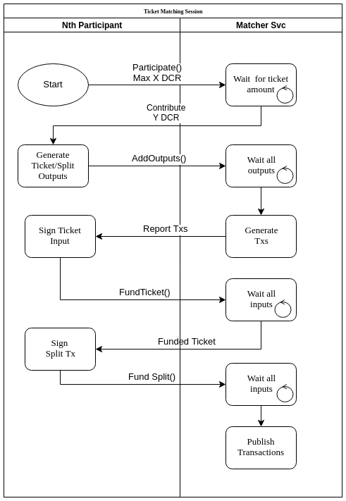

# Ticket Matcher Service Design

## Glossary

- **Participant**: A wallet contributing some amount of DCR to the ticket
- **Session**: A group of participants in the process of creating a shared ticket
- **Matcher**: The backend service that collects outputs and generates the ticket

## General Flow




- `Participate()` informs the matcher service that a wallet can contribute at most X DCR
  - The matcher waits for as many participants as needed, until the ticket price is met
  - Replies with the ticket amount + fees that the participant will enter session
- `AddOutputs()` sends the sstxsubmission (amount from previous step), sstxchange (usually 0), the split transaction outputs and input outpoints for the participant
  - The matcher waits for all participants to send their outputs and checks the validity of them
  - After all outputs are received, the matcher generates the ticket and split transaction templates plus a signed revocation for the ticket
  - Replies with the transactions for the participants
- `FundTicket()` signs the ticket inputs and sends the corresponding scriptSigs to the matcher
  - The matcher waits for all participants to send their corresponding scriptSigs
  - Replies with the fully funded ticket
- `FundSplit()` signs the split transaction inputs and sends the corresponding scriptSigs to the matcher
  - The matcher waits for all participants to send the corresponding scriptSigs for all inputs used in the split tx
  - Replies with the fully funded split tx

## Notes

- A single split transaction is created to reduce (though not eliminate) the chances of unilateral fee drain
- Funding the split transaction should only happen after the participant has confirmed the ticket, revocation and split txs are all valid and conform to the expected for the ticket purchase
- Stakepool fee is specified as one of the outputs of the single split tx (funded by the participants)

## Voting Rights

- The matcher decides the voting address for the ticket
- The strategy for determining the ticket address may be matcher-dependent
- The strategy for determining voting decision (block validity flag + agenda flags) may be matcher-dependent. Possible strategies:
  - Majority rule (choose whatever > 50% of what the participants want; abstain otherwise)
  - Supermajority rule (choose whatever > 75% of what the participants want; abstain otherwise)
  - Participant with highest contribution chooses
  - Randomly choose a participant
  - Randomly choose a participant, weighted by the contribution %
  - Pool always chooses the option (delegate authority)

Optionally, the voting private key may be disclosed to one of the participants (chosen using a known and previously publicized selection criteria) so that he can also vote the ticket.

## Revocation Rights

Revocation of missed and expired tickets is one of the most important concerns of the split ticket purchase service. Users must be sure that they will be able to redeem their funds if the pool is disabled (possibly forever).

The strategy for allowing revocation by any participant is the following:

- The matcher generates and signs a revocation transaction and includes it in the reply to the `addOutputs()` call to all participants
- Participants should ensure this revocation tx validates and then store it until the corresponding ticket is either voted, misses or expires
- Either the matcher or one or multiple participants may transmit the tx as appropriate

### Revocation Tx Storage

The requirement of having to store the revocation transaction until the ticket is voted, missed or expired is less than ideal as it introduces another piece of information an user needs to store along with their seed to have access to all of their funds.

There are two ways to mitigate this requirement:

- Have an independent (third-party to the participants and the matcher/pool - possibly as a community service) store the revocation transaction and monitor the blockchain to issue the revocation as needed
- Use a smart contract to allow anyone to revoke the transaction (indefinite revocation rights - see below)

### Indefinite Revocation Rights

The above strategy assumes at least one participant will not lose the revocation transaction and will be interested in actually publishing it. It breaks, preventing return of the funds if *all* participants plus the matcher lose the transaction (or the matcher loses the keys to the voting wallet or any similar situation).

To allow for ticket revocation even in the face of failures from all participants and matcher, we can design a script for the ticket submission output (output 0 of the SSTx) redeemable either by the matcher (signing the corresponding input of an SSGen or SSRTx) or by *anyone*. That is achieved by using a P2SH address in the ticket and a specially crafted and known in advance redeem script:

```
OP_IF
  OP_DUP OP_HASH160 [pool-phk-hash] OP_EQUALVERIFY OP_CHECKSIG
OP_ELSE
  [revocationRelLockTime] OP_CHECKSEQUENCEVERIFY
OP_ENDIF
```

The semantics for this smart contract is that a revocation transaction can be crafted either by signing the input with the appropriate private key **OR** by setting an appropriate value for the txin `sequence` field.

Ordinarily, an UTXO using this script would be spendable by anyone and allow the coins to be sent to any other address, however the consensus rules for stake transactions ensure that the funds of an SSTx can be spent only on a very specific way, to wit:

- Funds from the outputs of an SSTx can **only** be spent by an SSGen or SSRTx
- Funds from an SSTx can **only** be sent to the addresses of the stake commitment outputs (odd-numbered outputs)
- Rewards of an SSGen must **always** be distributed proportionally to the commitment amounts
- Fees payable on an SSRtx are limited to a maximum amount (fee allowance) encoded in the commitment output

Stake transactions not following these rules cannot be mined on a block and are considered invalid. Therefore, the above script can be used as a redeem script of tickets, such that the ticket can be revoked if missed/expired by **anyone** (as long as the particular script used by a pool is known).

The advantage of using the above script over simply storing the revocation is that the script can be known ahead of time (or is otherwise deducible from previous submitted transactions), it is smaller to store, may be reused among multiple tickets and removes the need for the pool to ever disclose any of its private keys.

The only drawback of having to execute the `ELSE` branch of the above script is the possibility of paying a slightly increased amount of transaction fees (up to the individual limits of the ticket commitments) which in a default ticket commitment as generated by the current version of dcrwallet is ~0.16 DCR (0x18 limit byte).

The `revocationRelLockTime` value must be chosen such that there is opportunity to send the previously signed revocation transaction (with the reduced tx fee) before anyone (possibly a miner interested in the higher fees) sends the unlocked revocation tx. Also, it must ensure that a vote **cannot** be cast before end of the ticket expiration window. Therefore, a value of `TicketExpiry + 7 days-worth-of-blocks` (or some other similar time) could be selected.

Example of revocation using the above script:

https://testnet.dcrdata.org/api/tx/decoded/52cc60a2008b64d9e558be34a25820995a38b0c05fd735c578f238d7517752f0?indent=true

(notice on the above the sequence value is **not** the one that should be used in production - it was chosen only to test the script in a more timely fashion).


## Outstanding Issues

- How to prevent spam?
  - Require signing the outpoints to be used during `addOutputs()`? Or require the outpoints on `Participate()`?
- Model possible influence growth attacks (dcr owners buying more influence on split tickets than on single tickets)
